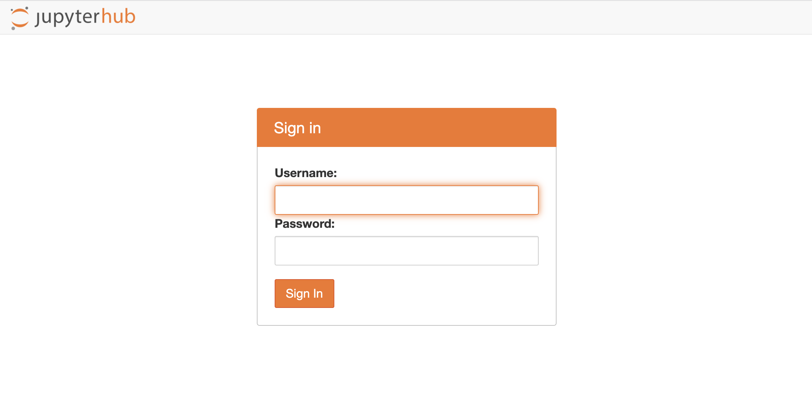

Our eventual target is to be able to run JupyterHub in Kubernetes in a container from a container image, but we are going to start by deploying it locally first.

Following best practice, first create a Python virtual environment in which to install the JupyterHub and Jupyter notebook software. To do this, run:

```execute
python3 -m venv jupyter-venv
```

Having created the Python virtual environment, activate it so the Python runtime from the Python virtual environment is used.

```execute
source jupyter-venv/bin/activate
```

Before installing any additional Python packages, ensure the latest version of ``pip`` is installed into the Python virtual environment by running:

```execute
pip install -U pip
```

In order to work in its default configuration, JupyterHub needs to use a proxy, which is used to route user sessions to their respective Jupyter notebook instances. This proxy is implemented in node.js. To install it locally run:

```execute
npm install configurable-http-proxy
```

Now install JupyterHub using:

```execute
pip install jupyterhub
```

Initially we are going to have JupyterHub spawn local instances of the Jupyter notebook application, so we install it as well.

```execute
pip install notebook
```

To run JupyterHub now run:

```execute
jupyterhub
```

To access the JupyterHub application click on the link:

```dashboard:open-url
url: {{ingress_protocol}}://{{session_namespace}}-8000.{{ingress_domain}}/
```

This should bring up the JupyterHub login page.



You will not be able to login, so trigger the running JupyterHub instance to shutdown by interrupting it.

```execute
<ctrl-c>
```
