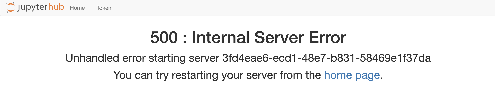

We have JupyterHub running but we can't actually login. This is because the default configuration for JupyterHub is to use the Linux system pluggable authentication mechanism (PAM). That is, it would use the Linux hosts password database or associated authentication provider. In this workshop environment PAM is not available for authenticating users.

To remedy this, JupyterHub needs to be configured to use a different authenticator.

A range of different authenticators are available, including the ability to hook into OAuth providers, LDAP and Kerberos.

For testing, a dummy authenticator is available which will accept any username/password combination, but a more interesting authenticator is an authenticator which allows temporary anonymous sessions.

Trigger the running JupyterHub instance to shutdown by interrupting it.

```execute
<ctrl-c>
```

To install the authenticator run:

```execute
pip install jupyterhub-tmpauthenticator
```

Although we have installed the authenticator, we still need to configure JupyterHub to use it.

To generate a sample of the configuration file that JupyterHub accepts run:

```execute
jupyterhub --generate-config
```

This will create the ``jupyterhub_config.py`` file. Based on the extension used on the configuration file, you can see that Python code is required to be used to configure JupyterHub.

This generated configuration file has a huge number of options that can be set. You can view the documented set of configuration options by running:

```execute
cat jupyterhub_config.py
```

We are only interested in a few options, so we will use a pre-created configuration file with just the options we need.

To view the first version of the configuration run:

```execute
cat jupyterhub-v1/jupyterhub_config.py
```

All the configuration file should contain is:

```
c.JupyterHub.authenticator_class = 'tmpauthenticator.TmpAuthenticator'
```

Run JupyterHub again, but tell it to use this configuration file.

```execute
jupyterhub -f jupyterhub-v1/jupyterhub_config.py
```

To access the JupyterHub application click on the link:

{{ingress_protocol}}://{{session_namespace}}-local-8000.{{ingress_domain}}/

Now although we weren't presented with a login page and instead were automatically given a user identity, a failure occurred in trying to create a Jupyter notebook instance.


